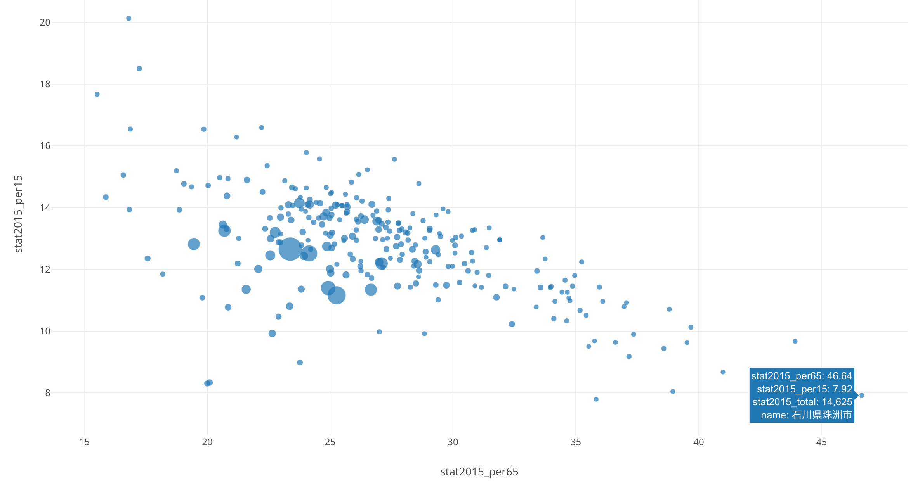

# ja_opendatacities
## 日本のオープンデータ地域の集計データ
- オープンデータ公開都市（自治体）数を県単位で集計したものです．
- 人口カバー率は下記，総務省データにもとづきオープンデータ公開自治体の人口数を県内の総人口と除して算出しています．
- 本データは簡易的に算出したものであり，正確性は保証できません．また，本データを利用することにより、あらゆる不利益、不都合が生じた場合についても、当方では一切の責任を負いません。

## ファイルについて
- ja_opendata_cities_census2015.csv: オープンデータ取組済自治体と総務省国勢調査（2015年）都道府県・市区町村別統計表をあわせたもの
-  	ja_opendata_cities_prefstat180303.csv: 上記および総務省国勢調査（2015年）都道府県・市区町村別統計表を基に都道府県単位で集計したもの

## 概略集計
- オープンデータ自治体数（264）／全自治体数（1,718）= 15.4%
- オープンデータ地域数（439） ／全地域数（1,902) = 23.1%
- * 地域数は，自治体数に加えて政令指定都市内の区を加算したもの
- オープンデータ都市の人口数（67,320,097人）／人口総数（127,094,745人）= 人口カバー率53.0%

## 使用データ
- 政府CIOポータル　オープンデータ取組済自治体一覧（平成29年12月20日時点） 
- 総務省　国勢調査（2015年）都道府県・市区町村別統計表  都道府県・市区町村別統計表（男女別人口，年齢３区分・割合，就業者，昼間人口など） 
